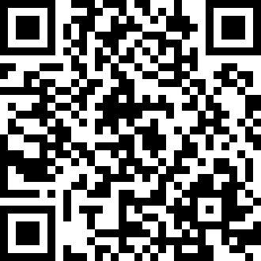
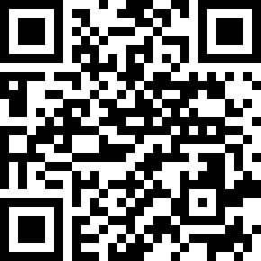
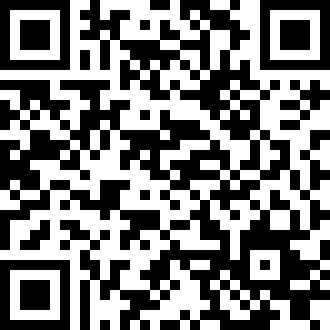

# Digital Vernissage
Cordova / Phonegap App for a digital vernissage. Scan a QR Code and get the related information. 
This is currently an alpha version.

## Build & Run
    
    npm install
    npm run serve
    
You are now able to connect via the [Phonegap Developer App](https://play.google.com/store/apps/details?id=com.adobe.phonegap.app). Scan some of the Sample QR Codes.

### Android
To run the App on your Android device connect it via USB.
    
    npm run android
    
## Sample QR Codes

Sind wir wirklich offen für neue Ideen oder nur für solche innerhalb des aktuellen Systems? Interessante Ideen erfordern oft, dass das System geändert wird... Wie wäre es mit 'JA, UND...' statt 'JA, ABER...'?

Die Selbsterkenntnis: Sehen!

Sitzen,  sehen,  zuhören,  achten.  Vielleicht  mal  handeln.

